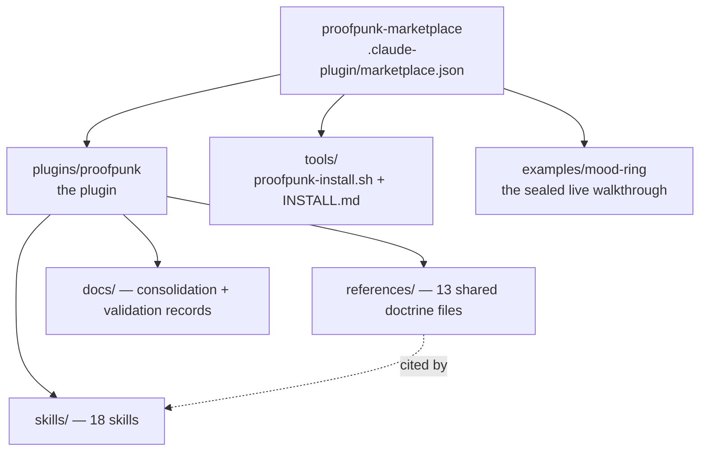
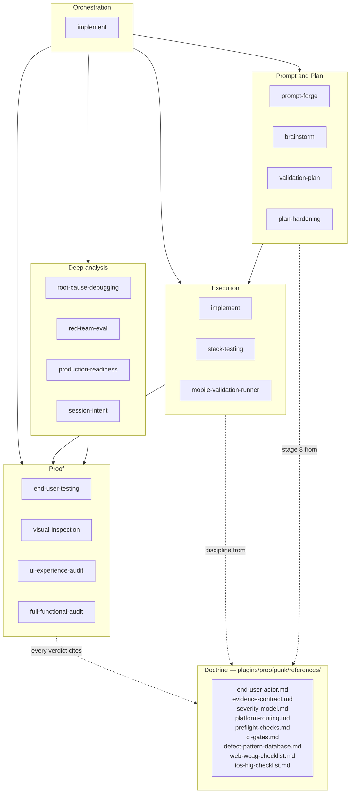
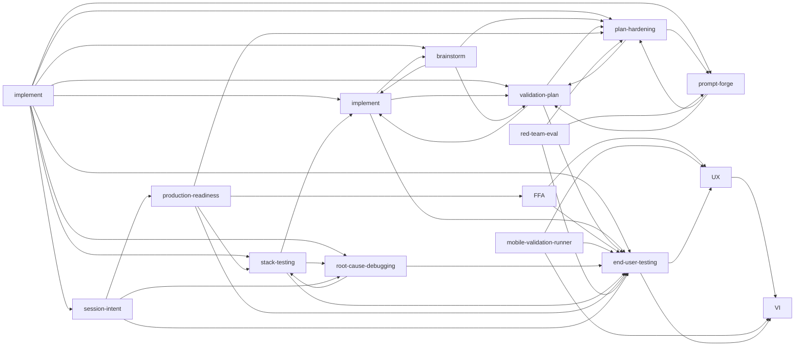
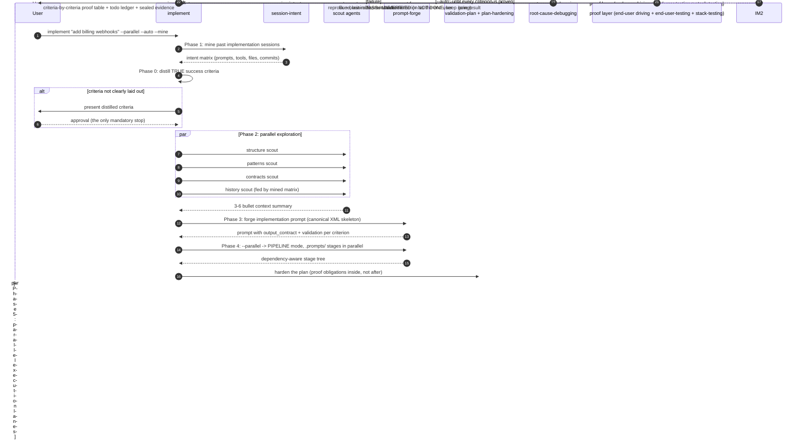
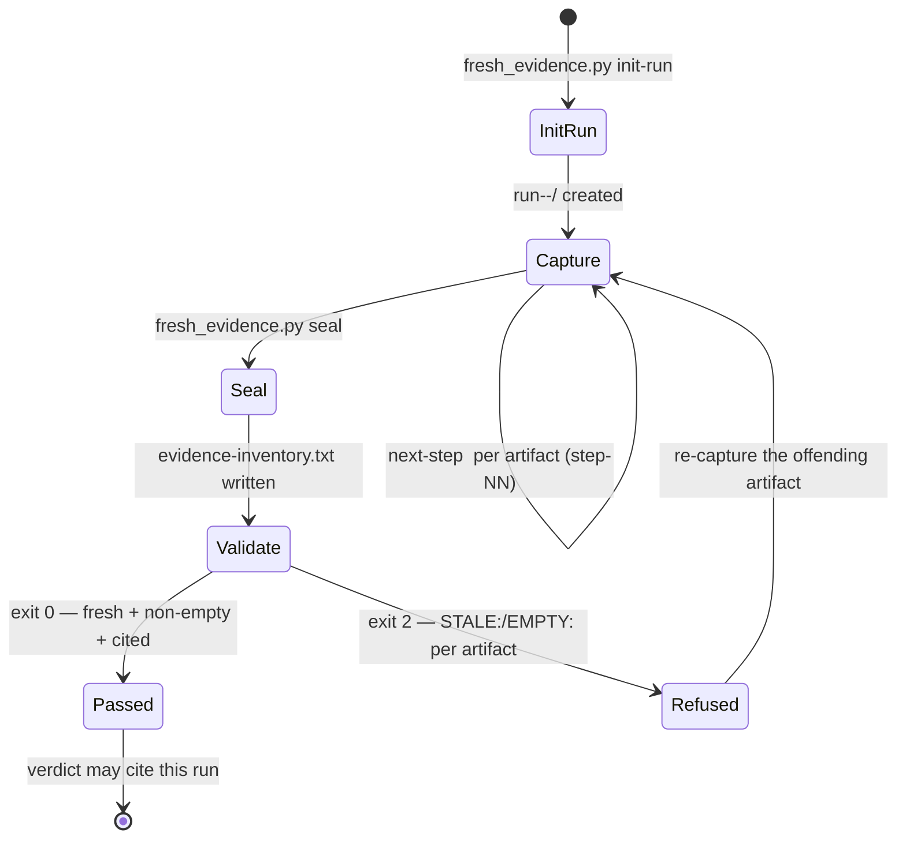

# Proofpunk

An execution-first delivery **plugin for Claude Code, oh-my-pi (OMP), and OpenCode**:
18 skills that make "done" mean *proven by end-user testing*. The AI drives the real system as an end user — clicking,
typing, submitting via MCP/automation tools — and any claim it did not actually execute
is reported **UNVERIFIED**, never PASS. No mocks, no stubs, no test-mode bypasses.

## Install

**Claude Code** (plugin — skills, commands, SessionStart doctrine hook):

```
/plugin marketplace add krzemienski/proofpunk
/plugin install proofpunk@proofpunk-marketplace
```

**oh-my-pi / OMP** (plugin — skills, commands, doctrine-guard extension; catalog at
`.omp-plugin/marketplace.json`, Claude-compatible `.claude-plugin/` fallback):

```
omp plugin marketplace add krzemienski/proofpunk
omp plugin install proofpunk@proofpunk
```

**OpenCode** — the installer drops the plugin, commands, 4 agents, and skills into
`~/.config/opencode/`, or use the full plugin via the same catalog above.
**Any agent** — plain skills into any directory:

```
bash tools/proofpunk-install.sh --target claude-code            # ~/.claude/skills (also read by OpenCode + OMP)
bash tools/proofpunk-install.sh --target omp --themes --plugins # oh-my-pi skills + themes + extension
bash tools/proofpunk-install.sh --target opencode --themes --plugins
bash tools/proofpunk-install.sh --target agents                 # ~/.agents/skills (shared)
```

Or download `proofpunk-marketplace.tar.gz` from this repo's release artifacts and
extract it into your marketplaces directory.

**Version labels vs. real tags:** only `v2.1.0` and `v2.2.0` exist as git tags
in this repository. Earlier versions (`v1.x`, `v2.0.x`) were labeled in commit
messages only, so `--ref v1.10.0` does not resolve. To pin a pre-tag install,
pass the full commit SHA — `--ref` accepts branch, bare SHA, or tag.

**Upgrading from v1.10.0–v2.1.0?** `--hooks` installs on those versions copied
`evidence-guard.sh` to disk but never registered it in `settings.json` — secrets-in-evidence
enforcement was silently inert for that hook. Fixed in v2.2.0 (`99c72fb`). Re-run
`bash tools/proofpunk-install.sh --hooks` to activate it. To check your own state, open
`settings.json` and confirm `evidence-guard.sh` appears in the `hooks` array, not just on disk.

## Themes — 20 flat-black cyberpunk variations

`plugins/proofpunk/themes/` ships 20 themes (neon-tokyo, acid-rain, vapor-grid,
code-fall, static-noir, …) inspired by the Hyper terminal's theme contract: pure
`#000000` canvas, two-neon accent systems, tuned status colors. One canonical
palette source (`themes/palettes.json`) renders to three formats via
`tools/generate-themes.py`:

| Format | Files | Install target |
|--------|-------|----------------|
| OMP theme JSON | `themes/omp/*.json` | `~/.omp/agent/themes/` |
| OpenCode theme JSON | `themes/opencode/*.json` | `~/.config/opencode/themes/` |
| Hyper module | `themes/hyper/*.js` | merge into `~/.hyper.js` (decorateConfig contract) |

`proofpunk-install.sh --themes` copies them into every detected platform.
Claude Code has no custom-palette API, so the Claude plugin ships the themes
for the other surfaces you run beside it.

## The skills

| Skill | What it enforces |
|-------|------------------|
| `proofpunk` | Entry router: classifies the request and hands off to the shortest ordered chain across the 17 delivery skills it routes to |
| `brainstorm` | Scout-first, exact-requirements, present-before-asking discipline; no code before an approved design |
| `prompt-forge` | Prompt AUTHOR / RATE (7-dimension /100 rubric) / OPTIMIZE / PIPELINE modes with a scored quality bar |
| `validation-plan` | BRIEF → ROADMAP → per-phase PLAN/SUMMARY/VALIDATION with blocking **cumulative** proof obligations |
| `plan-hardening` | Confidence-gap scoring, 4 red-team lenses, dispositioned gap register, proof-obligation injection |
| `implement` | The single write path: mandatory codebase scouting, session mining (`--mine`), prompt-forged plans, parallel lanes (`--parallel`), no-stop mode (`--auto`), live execution ledger — with end-user validation INLINE after every task (never a separate skill, never a test file) |
| `end-user-testing` | Run-scoped fresh evidence (`fresh_evidence.py`: init-run/next-step/seal/validate), verdict templates |
| `visual-inspection` | Screenshot-driven visual QA with severity model (found a real HIGH defect in the demo) |
| `ui-experience-audit` | 6-phase UX protocol: triage, visual, interactive, content, Nielsen heuristics, synthesis |
| `full-functional-audit` | App-wide interaction inventory → execute → remediate → verdict |
| `stack-testing` | Per-stack real-system test discipline: pytest/Go/C++/Django/Spring gotchas, FastAPI SSE testing, Playwright e2e, condition-based waiting (no sleeps, no new mocks) |
| `mobile-validation-runner` | iOS end-user validation: SETUP→RECORD→ACT→COLLECT→VERIFY, three-facet checks, simctl/XC-MCP/Expo lanes, preflight checks |
| `root-cause-debugging` | Reproduce-first diagnosis, backward call-chain tracing, pollution bisection; symptomatic hacks forbidden |
| `production-readiness` | 8-phase ship-readiness audit + spec-compliance matrix (COVERED/INCOMPLETE/MISSING) + dependency supply-chain health |
| `red-team-eval` | 4-lens hostile review of plans/prompts/artifacts, eval-driven development, QA cycling until measured goal attainment |
| `session-intent` | Reconstruct what was actually ASKED from Claude Code transcripts themselves: per-session intent matrix, session-to-commit alignment, intent-vs-implementation verdicts |
| `codebase-truth-audit` | Evidence-backed repo-wide truth audits: intent-from-history, code/config/doc/runtime verification, approval-gated remediation (the code-truth lane to session-intent's intent lane) |
| `tui-testing` | TUI/terminal end-user proof: observe-then-act PTY driving, matched-assertion waits, three-facet evidence (screen + disk + logs), pixel proof for visual claims |

`prompt-forge` gained its always-on workflow + command surface in v1.4.0/v1.5.0, `implement` arrived in v1.5.0, and `codebase-truth-audit` in v1.6.0 — closing the last dangling Related Skills edge (session-intent's intent → code-truth pipeline). **v1.7.0**: the doctrine moved from gate-logic to execution-logic — tasks carry proof obligations, validation is end-user testing always, `evidence-gates` became `end-user-testing` — plus the 20-theme flat-black cyberpunk pack and OMP/OpenCode platform support. **v1.8.0**: the project is renamed **Proofpunk** — repo, marketplace, plugin, commands (`/proofpunk:*`), installer (`proofpunk-install.sh`), and doctrine (`proofpunk-doctrine`) all carry the new brand; install commands are `… marketplace add krzemienski/proofpunk`. **v1.9.0**: `tui-testing` (new skill) — the TUI proof discipline measured from the aperant-tui gate runs — plus round-2 measured improvements to `end-user-testing`, `functional-validation`, `root-cause-debugging`, and `cook` (see `proofpunk-skills-improvement-report-round2.md`). **v1.10.0**: deterministic doctrine — five lifecycle hooks (Stop/SubagentStop unproven-claim block, PreToolUse secrets-in-evidence deny, InstructionsLoaded observability) and `/proofpunk:install`, the project-memory installer (CLAUDE.md ≤200 lines merged via markers + scoped `.claude/rules/`); behavior proofs in `tools/test-hooks.sh` and `evidence/hooks-release/`. **v1.10.1**: stop-guard is silent when there is nothing to enforce (per-stop reminder removed after live multi-plugin session noise). **v2.0.0**: ONE write path — `cook` merged into `implement` and `functional-validation` absorbed as implement's inline Stage 5 (the runbooks moved to shared `references/`); no test files anywhere in the pipeline (PreToolUse hard-block); PostToolUse walkthrough requirement; stop-guard now demands a scout record too; plugin-bundled agents for Claude Code (`agents/implement|scout|end-user-validate`), OpenCode, and OMP so subagents carry the skills in their own context. Behavior proofs: `tools/test-hooks.sh` 19/19; graph verifier PASS @ 17 skills. **v2.0.1**: installer hardening from a real multi-target run — ghost skill entries removed (cook/functional-validation no longer warned), exec bits committed, citation depth normalization + bundler fixed for nested references/ files, per-skill verbose verification, broken refs **auto-repair** then re-verify, and version reporting (installed → source) on every run.

**Hands-on invocation examples for every skill (`/skill-name <positional> --flag`): `plugins/proofpunk/docs/usage-guide.md`.**
Five were added in v1.1.0 and `session-intent` in v1.2.0 from a second full-universe scan (664 unique skills
across both source archives, classified by usefulness domain) — see
`plugins/proofpunk/docs/consolidation-decisions.md`.

Shared doctrine lives in `plugins/proofpunk/references/` — the Iron Rule (fix the real
system), the End-User Actor Mandate, the evidence contract, severity model, platform
routing, preflight checks, and CI gate classification.


## Command reference — every argument, every permutation, what executes

Conventions: `<angle>` = required positional argument, `[bracket]` = optional,
`A | B` = alternatives, `--flag=value` takes a value. **Skills executed** names
the skills that fire beyond the one invoked, in firing order, taken from each
skill's own Related Skills / delegation contract.

### Dispatch at a glance

| You run | Skill that fires | Then delegates to |
|---------|------------------|-------------------|
| `implement "<goal>" [flags]` | `implement` | session-intent, brainstorm (scouts), prompt-forge, validation-plan, plan-hardening, root-cause-debugging, end-user-testing |
| `implement mine [filters]` | `implement` (Phase 1 only) | session-intent |
| `prompt-forge author\|rate\|optimize\|pipeline ...` | `prompt-forge` | none (leaf); pipeline stages later execute under implement |
| `session_intent.py [filters] [outputs]` | `session-intent` | none (leaf tool) |
| `fresh_evidence.py init-run\|next-step\|seal\|validate` | `end-user-testing` | none (leaf tool) |
| `with_server.py --server ... --port ... -- <check>` | `stack-testing` | none (leaf tool) |
| `/proofpunk:install [--clobber] [--no-rules]` | project memory installer (command) | writes CLAUDE.md + `.claude/rules/` from `assets/` |
| `proofpunk-install.sh [flags]` | installer (tools/, not a skill) | installs all 18 skills + doctrine |

---

### 1. `implement` — orchestrated implementation

```
implement <goal> [--parallel] [--auto] [--mine] [--fast]
implement mine [--project DIR] [--since DATE] [--until DATE]
```

**Positional arguments**

| Argument | Why it exists | What happens |
|----------|---------------|--------------|
| `<goal>` | the implementation target, in natural language | fed to Phase 0 and distilled into TRUE success criteria (observable, end-user provable, measurable); unclear goals stop here for your approval |
| `mine` (subcommand) | reconnaissance-only mode | runs session mining and prints the previous-implementations matrix; zero code touched |

**Flags**

| Flag | Why it exists | What happens |
|------|---------------|--------------|
| `--parallel` | multi-module goals where wall-clock matters | parallel scout agents (structure/patterns/contracts/history), plan authored as a `.prompts/` pipeline with parallel independent stages, execution split into parallel lanes by module boundary |
| `--auto` | unattended runs with a real finish line | no stopping until every success criterion is proven as the end user; the ONLY mandatory stop is Phase 0 approval when criteria aren't clearly laid out; destructive ops, out-of-scope edits, below-threshold shipping still stop for consent |
| `--mine` | you've implemented similar things before | Phase 1 runs session-intent: past sessions become an intent matrix (prompts, tools, files, commits) that feeds exploration and forging |
| `--fast` | known territory, known stack | planning's research sub-step skipped (implement --fast semantics) |
| `--project DIR` (mine) | scope mining to one project | substring filter on project dir slug / cwd |
| `--since DATE` / `--until DATE` (mine) | time-box the mining | transcript events outside the window are excluded |

**Permutations — what each combination does and what you end up with**

| Invocation | Why you'd use it | What happens, end to end | Skills executed | You end up with |
|------------|------------------|--------------------------|-----------------|-----------------|
| `implement "add billing webhooks"` | standard supervised run | Phase 0 criteria (approval if unclear) → explore → forge prompt → plan → execute the task loop (prove each task as you go) → report from the ledger | prompt-forge → validation-plan → plan-hardening → implement (scout → build → end-user validate inline) → root-cause-debugging | implementation + criteria-by-criteria proof table + todo ledger |
| `... --mine` | reuse past approaches | Phase 1 mines sessions first; the intent matrix steers scouts (past touchpoints) and the forged prompt (framings that worked) | session-intent → *(as above)* | + previous-implementations matrix |
| `... --parallel` | multi-module, speed matters | 4 parallel scouts; prompt-forge PIPELINE authors `.prompts/` with parallel stages; `implement` executes lanes concurrently; contract checks serialize lane merges | *(scouts in parallel)* → prompt-forge (PIPELINE) → implement (parallel lanes, inline end-user validation) | + `.prompts/` tree with PROMPT.md + SUMMARY.md per stage |
| `... --auto` | run unattended | criteria confirmation (if the goal is unclear) is the ONLY mandatory stop; the loop executes → end-user tests → stuck protocol until every criterion is proven; UNVERIFIED = NOT DONE | + root-cause-debugging on every failure | proof table with PASS per criterion, or an explicit blocker statement naming the consent needed |
| `... --parallel --auto` | unattended multi-module | both behaviors combined; the stuck protocol handles failures automatically — only human-decision escalations (destructive ops, out-of-scope edits, unclear criteria) stop the run | *(both chains above)* | full pipeline artifacts + ledger-rendered proof table; the only stops are criteria confirmation and consent escalations |
| `... --auto --mine` | unattended, informed by history | mining feeds the criteria distillation itself (past intent sharpens what "done" means) | session-intent → full auto chain | + intent matrix cited in the final report |
| `... --parallel --mine` | supervised but fast and informed | parallel scouts ALSO receive the mined touchpoint list as their History lane assignment | session-intent → parallel scouts → parallel pipeline → supervised implement | combined artifacts, human checkpoints intact |
| `... --parallel --auto --mine` | "full send" | every stage maximally delegated; the run stops only for criteria confirmation (if needed) and authorization-boundary consents | session-intent → parallel scouts → prompt-forge PIPELINE → parallel implement lanes → root-cause-debugging loop → end-user proof layer | everything above; the complete trail from mined intent to sealed evidence |
| any of the above `+ --fast` | you know the codebase cold | research sub-step skipped everywhere planning happens | same chains, research elided | same artifacts, faster planning |
| `implement mine` | "show me how we built things" | mining only, prints the matrix to stdout, exits | session-intent | previous-implementations matrix |
| `implement mine --project shop --since 2026-07-01` | scoped recon | AND-composed filters: only July+ sessions in the shop project | session-intent | filtered matrix |

**Conflicts**: no two flags conflict. Unknown flags are rejected with the flag
table. `--auto` never overrides the authorization boundaries.

---

### 2. `prompt-forge` — author / rate / optimize / pipeline

```
prompt-forge author "<goal>" [--out PATH] [--depth core|advanced]
prompt-forge rate NAME.md [--in-place] [--report-only] [--ship-below-threshold] [--out PATH]
prompt-forge optimize NAME.md --evidence FILE [--in-place] [--out PATH]
prompt-forge pipeline "<goal>" [--dir PATH]
```

**Positional arguments**

| Argument | Why it exists | What happens |
|----------|---------------|--------------|
| `"<goal>"` (author, pipeline) | the prompt's purpose in natural language | drives the 5-7 intake questions, then authoring on the canonical XML skeleton |
| `NAME.md` (rate, optimize) | the prompt file under review | the rating's subject AND the default base name for output files (`NAME.rating.md`, `NAME.remediated.md`, `NAME.optimized.md`) |

**Flags** — each one IS a recorded authorization-engine consent:

| Flag | Modes | Why it exists | What happens |
|------|-------|---------------|--------------|
| `--out PATH` | all | you control where artifacts land | deliverable written to PATH instead of the default name |
| `--depth core\|advanced` | author | intake question 4 as a flag | core = instruction set only; advanced = few-shot set, edge cases, fallbacks |
| `--in-place` | rate, optimize | consent to edit your input file | the input file itself is replaced; no `.remediated`/`.optimized` copy |
| `--report-only` | rate | consent to skip file output | scorecard only; without this flag a rating with no remediated file violates the file-output contract |
| `--ship-below-threshold` | rate, optimize | sign-off for below-threshold shipping | a `needs-work`/`rewrite` result may be finalized; without it the report states what's still missing |
| `--evidence FILE` | optimize | OPTIMIZE's hard requirement, machine-checkable | real captured failure output drives the fix classification; WITHOUT this flag optimize does not run — it asks for a real bad output first |
| `--dir PATH` | pipeline | multi-pipeline repos | pipeline rooted at PATH (default `.prompts/<slug>`) |

**Permutations**

| Invocation | What happens | You end up with |
|------------|--------------|-----------------|
| `rate prompts/login.md` | rubric scoring against 3-5 built test cases → top fixes APPLIED → remediated version re-scored | `login.rating.md` + `login.remediated.md` + before/after scores |
| `rate prompts/login.md --in-place` | same, but `login.md` itself is replaced by the remediated version | `login.rating.md` + edited `login.md` |
| `rate prompts/login.md --report-only` | scorecard and predicted failure modes only | `login.rating.md` |
| `rate prompts/login.md --ship-below-threshold` | if the re-score still lands at needs-work, it ships anyway — with your sign-off recorded | files + recorded sign-off in the report |
| `rate prompts/login.md --out review.md` | artifacts at your path | `review.md` (+ `login.remediated.md`) |
| `optimize prompts/login.md --evidence bad-output.txt` | failures classified (ambiguity / missing context / format drift / reasoning gap / overflow) → targeted fixes → same test cases re-run | `login.optimized.md` + before/after scores |
| `optimize prompts/login.md` (no --evidence) | **does not run** — demands a real captured bad output first | nothing; a question back to you |
| `author "a SQL review prompt" --depth advanced` | intake → authored prompt with few-shot set, edge cases, fallbacks | `a-sql-review-prompt.prompt.md` |
| `pipeline "onboarding revamp" --dir .prompts/onboarding` | dependency-aware Research/Plan/Do stages authored | `.prompts/onboarding/NN-stage/PROMPT.md` tree |

**Conflicts (rejected, fail fast)**: `--in-place` + `--out` (two
destinations), `--report-only` + `--out` (nothing to write). `--in-place` +
`--report-only` is accepted; `--report-only` suppresses remediation entirely,
so `--in-place` has no effect in that combination. Unknown flags rejected
with the table.

A complete worked rating — weak prompt, 34/100 scorecard, remediated file,
91/100 re-score — lives in `plugins/proofpunk/skills/prompt-forge/references/remediation-sample.md`.

Skills executed: none downstream (leaf). It is executed BY `implement`
(Phases 3-4) and pairs with `plan-hardening` / `validation-plan`.

---

### 3. `implement` — the single write path (execution reference)

```
implement "<goal>" [--parallel] [--auto] [--mine] [--fast]
implement mine [--project DIR] [--since DATE] [--until DATE] [--json]
```

implement IS the execution engine — cook merged into it at v2.0.0. The
pipeline: Stage 0 distill TRUE criteria → Stage 1 mine past sessions →
Stage 2 scout the real codebase (mandatory, subagents) → Stage 3 forge the
build prompt → Stage 4 decompose into proof-carrying tasks → Stage 5
execution loop (implement task → end-user validation inline → proof into the
ledger) → Stage 6 stuck protocol → Stage 7 report.

| Flag | Effect |
|------|--------|
| `--parallel` | scouts fan out; build splits into lanes bound by executable lane contracts |
| `--auto` | never stops until every criterion is proven; unclear criteria escalate before code |
| `--mine` | session mining first (never skipped with this flag) |
| `--fast` | scout collapses to a single quick pass (known territory) |

There are no `--tdd` / `--no-test` flags. The write path never produces
test files (the PreToolUse hook hard-blocks them); validation is the
completed user job, driven in the real runtime with run-scoped evidence.

**Permutations**

| Invocation | What happens |
|------------|--------------|
| `implement "add avatar upload"` | full supervised pipeline: scout → plan → per-task prove-as-user |
| `implement "add avatar upload" --fast` | single-pass scout; checkpoints unchanged |
| `implement "add avatar upload" --auto` | continuous until proven; only criteria/authorization stops |
| `implement "add avatar upload" --parallel --mine` | parallel scouts fed by the mined touchpoint matrix |
| `implement "add avatar upload" --parallel --auto --mine` | everything maximally delegated; full trail from mined intent to sealed evidence |

Skills invoked: `session-intent` (Stage 1), `brainstorm` (Stage 2 scout
gates), `prompt-forge` (Stage 3), `validation-plan` (Stage 4 proof-obligation
format), `end-user-testing` (Stage 5 proof standard), `tui-testing` (Stage 5
for terminal UIs), `root-cause-debugging` (Stage 6). The platform runbooks
(`references/api|web|cli|ios-validation.md`) are shared doctrine loaded
directly by Stage 5 — they are not a skill.

---

### 5. `session-intent` — transcript mining

```
python3 scripts/session_intent.py [--projects-dir DIR] [--project SUBSTR]
                                  [--since YYYY-MM-DD] [--until YYYY-MM-DD]
                                  [--json out.json] [--md out.md]
```

No positional arguments. Exit code 2 when no transcripts match (never a
silent empty success).

| Argument | Default | Why it exists | What happens |
|----------|---------|---------------|--------------|
| `--projects-dir DIR` | `~/.claude/projects` | non-standard transcript locations | scans DIR for `*.jsonl` transcripts |
| `--project SUBSTR` | all projects | scope to one codebase | substring filter on project dir slug / cwd |
| `--since` / `--until` | unbounded | time-box the reconstruction | events outside the window excluded |
| `--json out.json` | stdout matrix | machine consumption by other tools | writes the full per-session records as JSON |
| `--md out.md` | stdout matrix | attachable evidence artifact | writes the rendered intent matrix as markdown |

**Permutations**

| Invocation | What happens |
|------------|--------------|
| no args | mine everything under `~/.claude/projects`, print the matrix |
| `--project shop --since 2026-07-01` | AND-composed filters: July+ sessions in the shop project only |
| `--json out.json --md out.md` | both artifacts written; stdout still prints the summary |
| `--since 2026-08-01 --until 2026-08-07` | one-week window across all projects |

Skills executed: none (leaf tool). Consumed BY `implement --mine` /
`implement mine`; its matrix pairs with `production-readiness`
(spec-compliance vs intent-compliance) and `root-cause-debugging`
(when INTENT-PARTIAL rows reveal unauthorized scope).

---

### 6. `end-user-testing` — the fresh-evidence lifecycle

```
python3 scripts/fresh_evidence.py init-run <slug>
python3 scripts/fresh_evidence.py next-step <slug>
python3 scripts/fresh_evidence.py seal
python3 scripts/fresh_evidence.py validate
```

**Positional argument**

| Argument | Why it exists | What happens |
|----------|---------------|--------------|
| `<slug>` | run identity — evidence is run-scoped so stale artifacts can't be reused | `init-run` creates `run-<timestamp>-<slug>/` and prints the run_id; `next-step` prints the next `step-NN` prefix inside it |

This is a lifecycle, not a combinatorial flag set — the ordered sequence is
the only valid composition: **init-run → next-step × N (each evidence
capture) → seal → validate**. Exit codes: `0` OK; `2` refusal (bad slug,
no active run, stale/empty artifacts, missing metadata) — `validate` prints
`STALE:` / `EMPTY:` for every offending artifact so nothing fails silently.

Skills executed: none (leaf tool). It is executed BY implement's Stage 5,
`mobile-validation-runner`, `implement` Stage 7,
`red-team-eval`, `production-readiness` — every verdict in the plugin seals
through this lifecycle.

---

### 7. `stack-testing` — real-server test rigs

```
python3 scripts/with_server.py --server "<start-cmd>" --port N -- <check-cmd>
cd scripts/playwright && npm install && node run.js --help
```

| Argument | Why it exists | What happens |
|----------|---------------|--------------|
| `--server "<start-cmd>"` | tests need the REAL server, lifecycle-managed | starts the dev server, waits for the port (condition-based, no sleeps) |
| `--port N` | readiness is proven by the port answering | poll until accepting connections or fail loudly |
| `-- <check-cmd>` (trailing positional) | the actual check to run against the live server | runs your check (Playwright script, curl probe, pytest e2e), then tears the server down |

Skills executed: none (leaf tool). Consumed BY `implement`,
`root-cause-debugging` (turning a reproducer into a permanent regression test).

---

### 8. `tools/proofpunk-install.sh` — the installer

No positional arguments; everything is flags. Full table with
why-it-exists lives in `tools/INSTALL.md`; the flags:

| Flag | Why it exists |
|------|---------------|
| `--target claude-code\|omp` | which agent's skills dir to install into |
| `--dir PATH` | explicit skills dir (overrides --target) |
| `--source github\|local` / `--source-dir PATH` / `--ref REF` | where the skills come from: GitHub at a ref, or a local checkout |
| `--only a,b,c` | surgical subset instead of all 18 |
| `--list` | show what would be installed, then exit |
| `--override` | consent to REPLACE same-name skills (timestamped `.bak` backups) |
| `--backup` / `--no-backup` | backup control when overriding |
| `--with-doctrine` / `--no-doctrine` | include the proofpunk-doctrine bundle (Iron Rule, End-User Actor Mandate, remediation definition) |
| `--inject-claude-md FILE` | append the idempotent BEGIN/END PROOFPUNK RULES block to your CLAUDE.md |
| `--dry-run` | print the full plan, write nothing |
| `--verify` / `--no-verify` | post-install self-check (structure, citations, doctrine) |
| `--quiet` | summary only |

**Canonical permutations**

| Invocation | What happens |
|------------|--------------|
| `proofpunk-install.sh --target claude-code` | first-time: all 18 skills + doctrine + verify, from GitHub |
| `--target omp --themes --plugins` | 18 skills + 20 themes + doctrine-guard extension for oh-my-pi |
| `--only prompt-forge,implement --override` | surgical refresh of two skills, backups taken |
| `--source local --source-dir /path/to/repo --no-verify` | offline install from a checkout, self-check skipped |
| `--inject-claude-md ~/.claude/CLAUDE.md` | rules block appended once; re-running leaves it unchanged (idempotent) |

**Conflicts (fail fast)**: `--target` + `--dir` (two destinations);
`--dry-run` + `--override` (plan-only vs mutate); `--source github` without
network. Exit codes: 0 success, 1 environment/usage error, 2 install
failure, 3 unknown skill in `--only`.

---

### 9. Protocol skills — no flags, what fires when you invoke them

These skills take natural-language input only (no arguments); what matters
is what they execute downstream:

| You invoke | What happens | Skills executed downstream |
|------------|--------------|---------------------------|
| `brainstorm` | scout-first ideation with trade-off analysis; no code before an approved design | validation-plan (plan the design), plan-hardening (red-team it), implement (build it) |
| `validation-plan` | BRIEF → ROADMAP → per-phase PLAN/SUMMARY/VALIDATION with blocking cumulative proof obligations | plan-hardening (strengthen drafts), end-user-testing (executes the proof blocks), implement (executes phases) |
| `plan-hardening` | confidence-gap scoring, 4 red-team lenses, dispositioned gap register | validation-plan (the plans it hardens), prompt-forge (the prompts it hardens), brainstorm (upstream) |
| `visual-inspection` | screenshot QA with severity classification | ui-experience-audit (deeper pass) (exercise after visual PASS) |
| `ui-experience-audit` | 6-phase UX protocol (triage → visual → interactive → content → heuristics → synthesis) | visual-inspection (Phase 1), end-user driving per the shared runbooks (flagged flows), full-functional-audit (app-wide), end-user-testing (citations) |
| `full-functional-audit` | app-wide interaction inventory → execute → remediate → verdict | end-user driving inline (per-interaction protocol), end-user-testing (batch verdicts), ui-experience-audit (per-screen), validation-plan (fix list → plan) |
| `mobile-validation-runner` | iOS end-user validation: SETUP→RECORD→ACT→COLLECT→VERIFY; lanes: simctl (bundled, always available), XC-MCP (a11y-first UI automation), Expo/idb (React Native) | visual-inspection (audit every screenshot), ui-experience-audit (per-screen), end-user-testing (sealing), functional-validation (web/API equivalent) |
| `root-cause-debugging` | reproduce → minimize → hypothesize → instrument; fixes the ROOT CAUSE, never the symptom | stack-testing (reproducer → existing-suite guard), end-user driving (blast-radius re-check), plan-hardening (large fixes), end-user-testing (claims) |
| `production-readiness` | 8-phase ship-readiness audit + spec-compliance matrix + dependency health | full-functional-audit (drive everything), stack-testing (close gaps), end-user-testing (seal waves), plan-hardening (remediation plan) |
| `red-team-eval` | 4-lens hostile review of plans/prompts/artifacts + measured QA cycles | plan-hardening (planning-stage lenses), prompt-forge (rubric rating), end-user driving per the shared runbooks (post-convergence PASS/FAIL), end-user-testing (seal scores) |

---

## System architecture

### 1. Repository layout



### 2. The skill stack (layers)



### 3. Delegation graph (who actually invokes whom)

Edges taken from each skill's own contract — not aspirational.



### 4. One command traced: `implement "add billing webhooks" --parallel --auto --mine`



### 5. The evidence lifecycle (every verdict, every skill)



Every PASS the plugin ever reports hangs off this lifecycle; anything not
executed through it is reported **UNVERIFIED**, never PASS.

## The proof: `examples/mood-ring/`

A complete live walkthrough on the **Flaskr** tutorial app (from `pallets/flask`, BSD-3):
the **Mood Ring** feature (per-post mood emoji 😀🙂😐😢🔥 + filter bar), built and audited
end-to-end by the original 10 skills in series:

- `.planning/` — brainstorm, BRIEF/ROADMAP, proof-carrying phase plans, hardening gap register,
  per-phase SUMMARY+VALIDATION, visual-inspection / UX / full-functional audit reports
- `.prompts/` — the authored build prompt and its 91/100 rating
- `e2e-evidence/run-20260808T202017-mood-ring/` — the sealed evidence run
  (19 artifacts; `validate OK`), including 5 browser screenshots committed as PNGs
  (see the README in that directory for what each one proves).
- `flaskr/`, `tests/` — the implementation: 32/32 tests green (24 baseline + 8 new)

Highlights from the run: a forged `<script>alert(1)</script>` mood POST safely defaults
to 😐 with a flash notice; an invalid `?mood=🦄` returns 200 unfiltered; visual
inspection caught (and the loop fixed) a blue-on-blue invisible "All" filter label.

## Repo layout

```
.claude-plugin/marketplace.json   marketplace manifest
plugins/proofpunk/              the plugin (18 skills + references + docs)
examples/mood-ring/               the live walkthrough (app + plans + evidence)
```

## License

MIT for the Proofpunk plugin and documentation (see `LICENSE`). The Flaskr example
under `examples/mood-ring/` is derived from the Flask tutorial and remains BSD-3-Clause
(see `examples/mood-ring/LICENSE.txt`).
