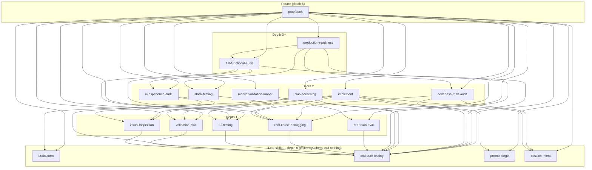

# Codebase Analysis — Phase 3 Current-State Examination
Measured: 2026-09-04T05:02:28Z (UTC) | Repo HEAD: 9963648 (working tree dirty — 2 untracked files: `docs/skill-canon.md`, `evidence/v3-release/00-baseline/command-surface-map.md`; current checkout tip is `40abc0b` per `git rev-parse HEAD`, nine commits ahead of `9963648`; tree content is identical at the plugin/tools paths this document audits — no commit between `9963648` and `40abc0b` touches `plugins/proofpunk/skills/`, `plugins/proofpunk/references/`, `plugins/proofpunk/hooks/`, or `tools/`)
Method: full end-to-end reads (`read`) of every file named in the assignment — all 18 `SKILL.md` files, every per-skill sub-reference/asset/script file, both 13-file shared `references/` and full `hooks.json` + all 9 hook scripts, all 7 `tools/` harnesses, and `fresh_evidence.py` at its real location under `plugins/proofpunk/skills/end-user-testing/scripts/` (confirmed absent from `tools/` — `os.path.isfile("tools/fresh_evidence.py")` → `False`). Every reference/asset/script citation across the 18 skills was extracted with regex and independently resolved against the filesystem (`os.path.isfile`) rather than inferred from names. Every "cannot see" claim below was verified either by reading the exact guard/hook source and its own regex/matcher, or by executing the installer/hooks against a scratch `mktemp -d` target (never against the live product tree) and diffing installed output against the checked-out source.

## Skill scorecard

18 skills confirmed by `os.listdir("plugins/proofpunk/skills")` filtered to directories. Description length = character count of the frontmatter `description:` field body (the folded YAML block), matching what an installed skill loader reads. "Own refs" = citations that live in that skill's `SKILL.md` file itself; "resolve" = the file both exists and is reachable via the exact relative path written (verified by `os.path.isfile` on the normalized join). "Broken" citations are counted separately in the Eval-surface / Eval-gaps sections below — none of them are in a `SKILL.md` top-level citation except `tui-testing`'s.

| # | Skill | Desc len (chars) | Scope boundary ("Not for...") | Neighbor overlap (shared 12-word shingles, top pairing) | SKILL.md refs: declared / resolve | Inbound edges (real, from `## Skill calls` graph) | Outbound edges | Verification today |
|---|---|---|---|---|---|---|---|---|
| 1 | `brainstorm` | 833 | executing an approved plan / end-to-end builds → `implement`; auditing finished work → `full-functional-audit` | 4 w/ `prompt-forge` (both cite the file-output / no-code-until-approval discipline) | 1/1 | 2: `implement`, `proofpunk` | 0 (leaf) | `sdk_probe.py:skill_brainstorm` (namespaced-load probe); `verify-orchestration.py` (structural only — graph edges, not content); `test-installer.sh` group 1 (SKILL.md exists post-install) |
| 2 | `codebase-truth-audit` | 759 | greenfield planning → `validation-plan`; feature builds → `implement`; mining transcripts → `session-intent` | 2 w/ `implement` | 2/2 | 2: `production-readiness`, `proofpunk` | 3: `session-intent`, `end-user-testing`, `root-cause-debugging` | `sdk_probe.py:skill_codebase_truth_audit`; `verify-orchestration.py`; `test-installer.sh` group 1 |
| 3 | `end-user-testing` | 838 | writing test suites → `stack-testing`; visual/UX review → `visual-inspection`/`ui-experience-audit` | 1 w/ `session-intent` | 6/6 | **13** (highest fan-in: every skill except `brainstorm`, `prompt-forge`, `session-intent`) | 0 (leaf — owns the canonical Actor Mandate + fresh-evidence rules) | `sdk_probe.py:skills_listed` (dedicated namespaced probe, checks the "only acceptable form of proof" text); `test-installer.sh` group 9 (strict `fresh_evidence.py` seal/validate contract: empty/unsealed/tampered runs must refuse rc=2, clean sealed run must pass rc=0); `verify-orchestration.py` (also asserts the verbatim Actor Mandate text appears ONLY here, never copied elsewhere); `test-installer.sh` group 1 |
| 4 | `full-functional-audit` | 811 | single-feature checks → shared runbooks; per-screen UX → `ui-experience-audit`; one known bug → `root-cause-debugging` | 8 w/ `ui-experience-audit` (highest single pairing in the whole graph) | 3/3 | 2: `production-readiness`, `proofpunk` | 4: `end-user-testing`, `ui-experience-audit`, `root-cause-debugging`, `tui-testing` | `sdk_probe.py:skill_full_functional_audit`; `verify-orchestration.py`; `test-installer.sh` group 1 |
| 5 | `implement` | 978 (longest description in the plugin) | planning without building → `validation-plan`; ideation → `brainstorm` | 3 w/ `full-functional-audit`, `plan-hardening`, `brainstorm` (spread thin, no dominant pairing) | 2/2 | 1: `proofpunk` | 7 (highest fan-out among delivery skills): `session-intent`, `brainstorm`, `prompt-forge`, `validation-plan`, `end-user-testing`, `tui-testing`, `root-cause-debugging` | `sdk_probe.py:skill_implement`; `verify-orchestration.py` (CHECK 5 additionally asserts each of `implement`'s 6 numbered Stage headings invokes its declared skill by name, in ascending stage order, and that a "regression posture" sentence exists); `test-installer.sh` group 1 |
| 6 | `mobile-validation-runner` | 727 (shortest description) | web/desktop/API → shared runbooks; non-iOS test suites → `stack-testing` | 1 each w/ 6 different skills (no concentration) | 27/27 (all top-level SKILL.md citations resolve) | 1: `proofpunk` | 2: `end-user-testing`, `visual-inspection` | `sdk_probe.py:skill_mobile_validation_runner`; `verify-orchestration.py`; `test-installer.sh` group 1 — **note:** none of these three exercise the skill's own 22-file `references/` tree, where 9 of the 20 broken internal citations documented below live |
| 7 | `plan-hardening` | 745 | authoring from scratch → `validation-plan`; executing → `implement` | 6 w/ `ui-experience-audit`, `validation-plan`, `full-functional-audit` (mid-tier overlap cluster) | 3/3 | 1: `proofpunk` | 3: `red-team-eval`, `validation-plan`, `end-user-testing` | `sdk_probe.py:skill_plan_hardening`; `verify-orchestration.py`; `test-installer.sh` group 1 |
| 8 | `production-readiness` | 737 | runtime feature QA → shared runbooks; screenshot review → `visual-inspection`; intent provenance → `session-intent` | 0 (no shingle overlap ≥1 with any neighbor) | 5/5 | 1: `proofpunk` | 4: `codebase-truth-audit`, `full-functional-audit`, `stack-testing`, `end-user-testing` | `sdk_probe.py:skill_production_readiness`; `verify-orchestration.py`; `test-installer.sh` group 1 |
| 9 | `prompt-forge` | 887 | executing build plans → `implement`; adversarial plan review → `plan-hardening`/`red-team-eval` | 4 w/ `brainstorm`, `validation-plan` | 9/9 | 2: `implement`, `proofpunk` | 0 (leaf) | `sdk_probe.py:skill_prompt_forge`; `sdk_probe.py:cmd_rate_prompt_flag` (dedicated command-surface probe — loads `proofpunk:prompt-forge` and asserts the loaded skill text contains `--ship-below-threshold`, not just the command doc); `verify-orchestration.py`; `test-installer.sh` group 1 |
| 10 | `proofpunk` | 718 | (no "Not for" clause — it is the router; "Routes to nothing" section instead) | 0 with every other skill (its body is a routing table, no prose overlap) | 13/13 | 0 (root — entry point, called by nothing) | **17** (calls all other 17 delivery skills — the maximum possible fan-out) | `sdk_probe.py:router` (dedicated — loads `proofpunk` itself, requires an observed `Skill` tool call whose argument matches `proofpunk` exactly, then quotes the first `Skill calls` table row verbatim); `verify-orchestration.py` (its 17 outbound edges are cross-checked against every other skill's `Called by:` claim); `test-installer.sh` group 1 |
| 11 | `red-team-eval` | 761 | root-cause finding → `root-cause-debugging`; pre-execution strengthening → `plan-hardening` | 1 each w/ 4 skills | 8/8 | 2: `plan-hardening`, `proofpunk` | 1: `end-user-testing` | `sdk_probe.py:skill_red_team_eval`; `verify-orchestration.py`; `test-installer.sh` group 1 |
| 12 | `root-cause-debugging` | 731 | full-site hunts → `full-functional-audit`; flaky-test discipline → `stack-testing`; pre-release audits → `production-readiness` | 2 w/ `visual-inspection` | 12/12 | **5** (2nd-highest fan-in): `codebase-truth-audit`, `full-functional-audit`, `implement`, `proofpunk`, `stack-testing` | 1: `end-user-testing` | `sdk_probe.py:skill_root_cause_debugging`; `verify-orchestration.py`; `test-installer.sh` group 1 |
| 13 | `session-intent` | 805 | live repo audits → `codebase-truth-audit`; planning future work → `validation-plan` | 1 w/ `end-user-testing` | 6/6 | 3: `codebase-truth-audit`, `implement`, `proofpunk` | 0 (leaf) | `sdk_probe.py:skill_session_intent`; `verify-orchestration.py`; `test-installer.sh` group 1 — none of the three exercise `references/scripts/analyze.sh` / `analyze-claude-md.sh` / `github-discovery.sh` / `fetch-features.sh`, nor `scripts/session_intent.py` (the actual JSONL parser) |
| 14 | `stack-testing` | 746 | end-user proof of a finished feature → `end-user-testing`; single-bug root causes → `root-cause-debugging` | 1 each w/ 5 skills | 15/15 | 2: `production-readiness`, `proofpunk` | 1: `root-cause-debugging` | `sdk_probe.py:skill_stack_testing`; `verify-orchestration.py`; `test-installer.sh` group 1 — has 2 distinct broken internal citations in `references/webapp-testing.md` (see Eval-surface map) that no harness catches |
| 15 | `tui-testing` | 746 | web UIs → `implement`'s validation phase; non-interactive CLIs → `references/cli-validation.md` (broken — see below) | 1 each w/ 8 skills, plus 1 w/ `mobile-validation-runner`, `red-team-eval` | **1/0 — the only skill in the plugin where a SKILL.md-declared citation fails to resolve** | 3: `full-functional-audit`, `implement`, `proofpunk` | 1: `end-user-testing` | `sdk_probe.py:skill_tui_testing`; `verify-orchestration.py`; `test-installer.sh` group 1 — none check that the skill's own "Not for..." clause names a real file; the broken `references/cli-validation.md` citation in its own frontmatter description is invisible to all three |
| 16 | `ui-experience-audit` | 807 | pixel-checklist screenshot QA → `visual-inspection`; app-wide sweeps → `full-functional-audit` | 8 w/ `full-functional-audit` (tied for highest pairing in the graph) | 10/10 | 2: `full-functional-audit`, `proofpunk` | 2: `visual-inspection`, `end-user-testing` | `sdk_probe.py:skill_ui_experience_audit`; `verify-orchestration.py`; `test-installer.sh` group 1 |
| 17 | `validation-plan` | 648 (2nd-shortest) | executing the plan → `implement`; hardening a draft → `plan-hardening` | 7 w/ `full-functional-audit`, 6 w/ `plan-hardening`/`ui-experience-audit` | 3/3 | 3: `implement`, `plan-hardening`, `proofpunk` | 1: `end-user-testing` | `sdk_probe.py:skill_validation_plan`; `verify-orchestration.py`; `test-installer.sh` group 1 — has 1 broken internal citation in `references/task-file-format.md` (see below) |
| 18 | `visual-inspection` | 672 | interactive UX flow audits → `ui-experience-audit`; driving running features → shared runbooks | 2 w/ `root-cause-debugging` | 5/5 | 3: `mobile-validation-runner`, `proofpunk`, `ui-experience-audit` | 1: `end-user-testing` | `sdk_probe.py:skill_visual_inspection`; `verify-orchestration.py`; `test-installer.sh` group 1 |

**Cross-checks performed on this table:**
- All 18 `Called by:` claims match the real computed inbound-edge set exactly (independently re-derived from every skill's own `## Skill calls` outbound table; zero mismatches) — same invariant `verify-orchestration.py` CHECK 4 enforces.
- Total shared 12-word shingles across all 18 skill bodies: **93** (well under the `verify-orchestration.py` `SHINGLE_THRESHOLD = 200` gate at `tools/verify-orchestration.py:24,138-139`). Highest single pairing: `full-functional-audit` ↔ `ui-experience-audit` at 8 shingles.
- Graph is acyclic (topological depths 0–5; `proofpunk` sits at depth 5 as the deepest node since it transitively reaches every other skill; `brainstorm`/`end-user-testing`/`prompt-forge`/`session-intent` are the four depth-0 leaves — this matches `verify-orchestration.py`'s own `declared_leaves` check exactly, since all four literally contain the string `"Leaf skill — owns canonical methods; calls nothing."`).
- **Edge-count discrepancy found:** `plugins/proofpunk/docs/architecture.md:123` states "47 edges total: 17 from the router to every skill, plus 30 among the 17 delivery skills." Independently re-summing the 17 non-router `CALLS` tables (`brainstorm:0, codebase-truth-audit:3, end-user-testing:0, full-functional-audit:4, implement:7, mobile-validation-runner:2, plan-hardening:3, production-readiness:4, prompt-forge:0, red-team-eval:1, root-cause-debugging:1, session-intent:0, stack-testing:1, tui-testing:1, ui-experience-audit:2, validation-plan:1, visual-inspection:1`) sums to **31**, not 30; total is **17 + 31 = 48**, not 47. `drift-inventory.md:44` (this session's own prior lane) flagged this exact line as "NOT independently re-verified" and left it UNRESOLVED — this pass resolves it: the doc is off by one edge. (Not corrected here — read-only lane, per assignment scope.)

## Eval-surface map

What each harness structurally **can** and **cannot** observe, with the file:line that makes each "cannot see" claim true.

### `tools/verify-orchestration.py` (153 lines)
**CAN see:** the literal text of every `SKILL.md`'s `## Skill calls` markdown table (regex `r"## Skill calls\n(.*?)(?=\n## |\Z)"` at `tools/verify-orchestration.py:45`, row pattern `r"^\| `([a-z0-9-]+)` \|"` at line 51); graph acyclicity via its own DFS (lines 60–72); whether `implement`'s numbered `## Stage N` headings, in textual order, each contain their expected callee skill name as a substring (lines 106–125, `stage_expect` list at 113–117); a shingle-based duplication metric over skill body text (lines 128–139); whether the verbatim string `"marking (validation|end-user testing) complete without the ai actually invoking"` (case-insensitive) appears in more than one skill body (line 140–143) — a copy-paste detector for one specific sentence.

**CANNOT see:**
- Whether a declared `references/X.md` / `scripts/X.py` / `assets/X.json` citation inside a skill actually resolves on disk. The script never opens a `references/`, `assets/`, or `scripts/` directory, never calls `os.path.isfile` on anything but `SKILL.md` paths (`tools/verify-orchestration.py:37-39`, `glob.glob(os.path.join(SK, "*", "SKILL.md"))`). This is why the 12 broken internal citations documented below (9 in `mobile-validation-runner`, 2 in `stack-testing`, 1 in `tui-testing`'s own `SKILL.md`) produce zero output from this gate.
- Whether a skill's prose *content* is correct, current, or safe to follow — it parses only the `## Skill calls` section and the `## Stage N` headings; every other heading (`## Workflow`, `## Anti-Patterns`, `## Reference Routing`, all Phase/Step sections) is untouched.
- Whether the numbers in `docs/architecture.md`'s prose (e.g. the "47 edges" claim) agree with the graph it just built — it computes the graph but never diffs it against any doc file.
- Runtime behavior of any kind — it does not execute a single skill, hook, or script; it is pure static-text parsing of `SKILL.md` files (`tools/verify-orchestration.py:32-35`, `body_of()` strips only the YAML frontmatter block and returns raw markdown).

### `tools/test-hooks.sh` (383 lines, 25+ numbered cases)
**CAN see:** the exact stdout/stderr/exit-code triple of each of the 9 hook scripts given hand-constructed JSON on stdin (e.g. `sh "$HOOKS/stop-guard.sh"` fed via heredoc at `tools/test-hooks.sh:37-38`); `bash -n` syntax validity of every `.sh` file in the hooks dir (lines 12–15); the Bash-bypass detector's before/after content-hash diffing for 8 named commands (`w1`–`w8`, lines 344–351) including that `cp -p`/`sed -i -e`/`touch -c`/no-op commands stay silent while test-file/tamper/deletion/secret-leak commands are noticed; the specific "scout-substring self-certification" regression case (24, lines 284–299) that proves the guard's own keyword-masking logic works.

**CANNOT see:**
- Any real Claude Code session, transcript format drift, or whether the JSON shape it hand-constructs (`{"role":"assistant","text":"..."}`, e.g. line 34) matches what a live host actually emits. `stop-guard.sh`'s own Python body extracts assistant text via `message.content` blocks (a documented, more complex shape — `plugins/proofpunk/hooks/stop-guard.sh:109-125`), not the flat `{"role":..,"text":..}` records this harness feeds it; the flat form is accepted only via the fallback branch at `stop-guard.sh:113-115` (`isinstance(record.get("text"), str)`). A production-shaped envelope missing that exact fallback field name would be invisible to this test suite even though it passes every case.
- Whether the 3 `PreToolUse` guards (`no-test-files.sh`, `evidence-guard.sh`, `capture-guard.sh`) or the 2 `PostToolUse`/`PostToolUseFailure` scripts actually get *invoked* by a real host on a real tool call — it calls each script directly as a subprocess with `sh "$HOOKS/x.sh" <<'EOF' ... EOF`, never through `hooks.json`'s registration path.
- Skill content, skill graph, or installer behavior — zero overlap with `verify-orchestration.py` or `test-installer.sh`'s scope.
- Whether `SessionStart`/`InstructionsLoaded` fire in the right *order* relative to a real conversation turn — it calls `session-start.sh` and `instructions-loaded.sh` each in isolation (lines 18, 301-310).

### `tools/test-installer.sh` (264 lines, 10 groups)
**CAN see:** real installer exit codes and on-disk state for: clean install of all 18 skills (group 1, asserts every `$T1/$s/SKILL.md` exists — line 47-49); collision-default non-clobber (group 2); `--override` + `.bak-*` backup creation (group 3); `--only <name>` single-skill install (group 4); `--only <nonexistent>` failure (group 5); `--dry-run` creates nothing (group 6); a malformed skill (no frontmatter) is rejected pre-copy (group 7, injects a synthetic bad skill into a throwaway `$SCRATCH_SRC`); `--hooks` registers every hook script into `settings.json` idempotently (group 8, `grep -c 'capture-guard.sh' "$S8"` must stay `1` across two runs — line 202); `fresh_evidence.py`'s strict seal/validate contract across 5 arms (group 9, lines 211–230: empty-seal, empty-validate, unsealed-validate, sealed-clean-validate, same-size-tamper-validate, expecting rc `2 2 2 0 2` respectively); and that the **installed tree's hook registrations parity-match `hooks.json`'s own declared structure** (group 10, lines 233–261) — this is the check whose absence historically let `session-start.sh` ship uncopied.

**CANNOT see:**
- Whether any *installed* skill's own internal reference citations resolve. Group 1's assertion is `[ -f "$T1/$s/SKILL.md" ]` only (line 48) — it never opens `$T1/$s/references/*.md` to check a single cross-citation. This is the exact gap this audit's live installer run (against `mobile-validation-runner` in a scratch `mktemp -d`) exercised directly: the installer's own `--verify` pass (which defaults ON, `VERIFY=1` at `tools/proofpunk-install.sh:31`) printed `✓ mobile-validation-runner` while shipping a tree where `references/xc-mcp-workflow-build-project.md` still cites the now-doubly-broken bare name `tool-reference.md` (the citation-rewrite `sed` at `tools/proofpunk-install.sh:297-298` strips the `references/` prefix from citations found *inside* `$dst/references/*.md` files, turning `references/tool-reference.md` into `tool-reference.md` — but the actual sibling file was bundled under its original name `xc-mcp-tool-reference.md`, so the rewritten bare citation still resolves to nothing on disk. The `find_bad()` checker's own regex, `r'(?:^|[^A-Za-z0-9._/-])((?:\.\./)*(?:references|scripts|assets|examples)/[^\s\`)\]]+)'` at `tools/proofpunk-install.sh:638-640`, requires a literal `references/`/`scripts/`/`assets/`/`examples/` path-segment prefix — the post-rewrite bare form `tool-reference.md` has none, so the defect becomes invisible to the installer's own self-check *after* the rewrite that created it). `test-installer.sh` group 10's parity check (line 233 onward) only diffs `hooks.json` structure against installed hook registrations — it has no analog for reference-citation parity.
- Any skill's *content* correctness, the skill graph, or hook decision logic — those are `verify-orchestration.py`'s and `test-hooks.sh`'s domains respectively; zero overlap.
- The GitHub-download install path (explicitly disclaimed at the top of the file: "every installer invocation in the harness passes a local `--source-dir`, so the installer's GitHub-download branch is never exercised here" — `tools/test-installer.sh:1-6` per its own header comment mirrored in `.github/workflows/gates.yml:11-15`).

### `tools/dry-run-install.sh` (88 lines)
**CAN see:** the `/proofpunk:install` slash-command's *documented* template-merge mechanics reimplemented standalone (marker-based `CLAUDE.md`/`AGENTS.md` injection, `.claude/rules/`/`.opencode/rules/` scoped-rule copying, placeholder substitution, ≤200-line budget) against two synthetic fixtures (`/tmp/pp-init-fixture`, `/tmp/pp-init-fixture-oc`).

**CANNOT see:** the actual `/proofpunk:install` command as an agent would execute it — this script is a parallel reimplementation of the command doc's Step 1–4 logic in bash, not an invocation of anything the plugin ships. It never reads `plugins/proofpunk/commands/install.md`'s prose and never drives a real Claude session through it. If `commands/install.md`'s actual instructions drifted from what this script encodes, nothing here would detect it — the script and the command doc are two independent implementations of the same intent, verified only by eye, not by any automated diff.

### `tools/sdk_probe.py` (388 lines, 27 named probes)
**CAN see:** real Claude Code session behavior via `claude_agent_sdk.query()` with the plugin actually loaded (`SdkPluginConfig(type="local", path=PLUGIN)` at line 192) versus a control arm with `setting_sources=[]` (line 196) — this is the only harness in the repo that drives a live model turn. Covers: doctrine injection into session context (`doctrine` probe); namespaced `proofpunk:<skill>` loadability for 16 of 18 skills plus 2 dedicated probes for `proofpunk` (router) and `end-user-testing` (`skills_listed`) — **18 of 18 skills covered**, contradicting a plain read of the `for _sk in (...)` tuple at lines 135-140 (16 names) since the two omitted names each have their own bespoke, more specific probe defined earlier in the file (lines 59-79); that the `no-test-files.sh` `PreToolUse` guard actually fires in a real session and the file is genuinely absent from disk afterward (`blocks_test_file` probe, lines 84-95, with `disallowed_tools=["Bash","Agent","Task","Edit","NotebookEdit"]` so the model cannot route around the `Write` tool); the mirror control that ordinary writes are NOT blocked (`allows_normal_file`); that the `Stop` hook event genuinely fires with a successful exit in a live turn; that the `InstructionsLoaded` tap genuinely appends a JSONL line attributable to *this run's* cwd (`loads_append`/`loads_this_run` checks, lines 341-362, using `os.path.realpath` to survive macOS's `/tmp` → `/private/tmp` symlink); two command-surface probes (`cmd_truth_audit_flags`, `cmd_rate_prompt_flag`) that load the SKILL via the `Skill` tool and assert specific flag text is present in what the AI actually sees, not merely present in the command doc.

**CANNOT see:**
- It is **not wired into `.github/workflows/gates.yml`** — confirmed by direct read of the workflow file (`.github/workflows/gates.yml:50-60`, exactly 4 named gates: `verify-orchestration.py`, `test-hooks.sh`, `test-installer.sh`, `dry-run-install.sh`; `sdk_probe.py` appears nowhere in the file) and confirmed by grepping `tools/AGENTS.md` for the string `sdk_probe` (zero matches outside its own one-line table row at `tools/AGENTS.md` — which is itself absent; `sdk_probe.py` has **no row in `tools/AGENTS.md`'s "Key Files" table at all**, unlike all 6 other `tools/` scripts). This means: no CI run, ever, exercises a live model session against this plugin. Every merge is gated only on static graph/hook/installer checks.
- It requires `claude_agent_sdk` (external pip package) and live model credentials — if either is absent, the script prints a JSON error and exits 2 (lines 39-42) rather than skipping gracefully; this is a hard external dependency the other 4 gates don't share (all 4 CI gates are explicitly hermetic per `gates.yml:11-15`: "no network, no secrets, no external deps").
- Content correctness of what a loaded skill *instructs* — every probe asserts either (a) a substring of the model's own reply text, (b) that a specific tool was invoked with a specific argument, or (c) a hook-event/log side-effect. None of the 27 probes read a skill's own `references/` tree or check citation resolution; that is entirely outside this harness's scope, same gap as the other three.

### `plugins/proofpunk/skills/end-user-testing/scripts/fresh_evidence.py` (271 lines) — not a test harness, but a runtime enforcement tool
**CAN see (when invoked by a session, not a CI gate):** run-directory freshness via a `.run-meta` `started=` timestamp compared against every `step-*` file's mtime (`cmd_validate`, lines 141-145); zero-byte artifacts (line 146-148); an unsealed run (missing `evidence-inventory.txt` or missing its `sealed=` line, lines 154-162); a **same-size content substitution** — the exact tamper class a naive size-only check would miss — via SHA-256 comparison per recorded row (lines 199-205, comment at 102-104 explicitly names this as the reason digests exist, not just sizes); artifacts written to disk *after* sealing (`UNSEALED ARTIFACT`, line 206-208); a hand-edited inventory whose summary `count=`/`total_bytes=` line disagrees with its own rows (lines 210-224); legacy (pre-digest) inventories that predate the tamper-evidence upgrade (lines 165-172).

**CANNOT see:** anything about *which* skill or workflow produced the evidence, whether the claimed assertion in a verdict actually matches what the screenshot/log shows (that is a human/AI judgment call the tool has no opinion on), or any content outside `./e2e-evidence/` in the current working directory (hardcoded `ROOT = Path("./e2e-evidence")` at line 31 — it has no awareness of the plugin's skill tree at all).

## Eval gaps

Every skill/command/reference/host surface with **no gate at all** — the concrete content of "remaining gate surface."

### Skills with zero content-level gate (structural graph check only)
All 18 skills get `verify-orchestration.py`'s structural pass (does the `## Skill calls` table parse, is the graph acyclic) and `test-installer.sh`'s existence check (`SKILL.md` copies). Of the 18, **2 additionally get zero namespaced-load coverage from `sdk_probe.py` under its generic loop** but are each covered by a dedicated bespoke probe instead (`proofpunk` → `router`; `end-user-testing` → `skills_listed`) — so all 18 in fact have *some* live-session probe. What none of the 18 get, from any harness: a check that the skill's *prescribed workflow* (its numbered Steps/Phases/Stages) produces the outcome it claims when actually followed. `sdk_probe.py`'s skill probes only confirm the skill *loads* and states one fact about itself in one sentence — none of the 16 generic probes drive the skill through even one of its own documented Steps.

### Reference files with zero gate, anywhere
- **All 13 shared `references/*.md` files** (`api-validation.md`, `ci-gates.md`, `cli-validation.md`, `defect-pattern-database.md`, `end-user-actor.md`, `evidence-contract.md`, `ios-hig-checklist.md`, `ios-validation.md`, `platform-routing.md`, `preflight-checks.md`, `severity-model.md`, `web-validation.md`, `web-wcag-checklist.md`) have **no automated check that their prose is internally consistent, current, or that every skill citing them quotes them correctly.** `verify-orchestration.py` never opens this directory. `test-installer.sh` never diffs an installed shared-reference copy against its source. The only mechanism touching this directory at all is the installer's own citation-bundling step (`tools/proofpunk-install.sh:301-320`), which copies a shared reference into a skill's bundle *if and only if* something inside the skill cites its bare filename — a copy-if-cited mechanism, not a correctness check.
- **Every one of the ~150 per-skill `references/*.md` files** (interactive-element-audit.md, content-quality-checklist.md, ux-heuristics-checklist.md, responsive-audit.md, debug-like-expert.md and its 5 "expert-*" siblings, root-cause-tracing.md, trace-competing-hypotheses.md, diagnose.md, all 5 `stack-testing` stack-gotcha files, `playwright-api-reference.md`, `playwright-browser-automation.md`, all 21 `mobile-validation-runner` files, `spec-compliance.md`, `dependency-health.md`, `production-readiness-audit.md`, `red-team.md`, `eval-harness.md`, `ultraqa.md`, `agent-eval-strands.md`, `output-contract.md`, `task-file-format.md`, `claude-code-analyzer.md`, prompt-forge's 7 reference files) — none are read by any of the 4 CI gates or `sdk_probe.py`. This is exactly the tree where the 12 broken-citation defects live (below), and it is entirely outside every gate's reach except the installer's rewrite-and-check pass, which as shown above can mask defects it creates.
- **Bundled scripts inside skills** (`session_intent.py`, `find-polluter.sh`, `hitl-loop.template.sh`, `with_server.py`, `init_audit_workspace.py`, the 4 `session-intent` shell scripts, the 4 `mobile-validation-runner` shell scripts including `xc_mcp_wrapper.sh`'s 18 exported bash functions, the Playwright `run.js`/`lib/helpers.js` pair) — zero automated execution by any of the 4 CI gates. `sdk_probe.py` never invokes a skill-bundled script; it only observes whether the *skill file* loads.

### Commands with weaker gate than skills
All 6 Claude Code commands (`rate-prompt.md`, `truth-audit.md`, `verify.md`, `forge-prompt.md`, `implement.md`, `install.md`) plus their 6 OpenCode namespaced twins get **2 of 27 `sdk_probe.py` probes** (`cmd_truth_audit_flags`, `cmd_rate_prompt_flag`) — both load the *skill* via the `Skill` tool and check text, neither invokes the *command* file itself or its `$ARGUMENTS` substitution mechanic. The other 4 commands (`verify.md`, `forge-prompt.md`, `implement.md`, `install.md`) have **zero probes of any kind.** No harness confirms a command's frontmatter `argument-hint` matches what the skill actually accepts, or that the command's worked examples (each command file carries 3-5 hand-written example invocations) still produce the documented output.

### Host surfaces
- No gate drives the plugin end-to-end inside **OpenCode** or **OMP** — `sdk_probe.py` is Claude-Agent-SDK-specific (`claude_agent_sdk` import at line 26); the two other host platforms this plugin ships assets for (per `plugins/proofpunk/opencode/commands/*` and the installer's `--target` flag options) have no equivalent live-session probe anywhere in `tools/`.
- No gate verifies the **20-theme flat-black cyberpunk pack** (`plugins/proofpunk/themes/`) renders correctly in any real terminal — `tools/generate-themes.py` is a pure generator with no assertion of its own beyond determinism (byte-identical re-run, documented as a manual check at `tools/AGENTS.md:35`, not automated in `gates.yml`).
- No gate verifies `tools/build-site.py`'s generated `docs/*.html` actually renders or that its internal links resolve — the script's only self-check is the `assert len(enforces) == SKILL_DIRS` line (`tools/build-site.py:163`), which only guards README-table-row-count-vs-skill-dir-count, nothing about the generated HTML's own correctness.

## Hook interaction matrix

Which hook enforces which reference's contract, at which lifecycle event, on which tool matcher, and what each layer cannot see.

| Hook script | Event | Matcher | Enforces (reference/contract) | What THIS layer cannot see |
|---|---|---|---|---|
| `session-start.sh` (10 lines) | `SessionStart` | `startup\|resume\|clear` | Injects the plugin's one-paragraph doctrine summary (`../../references/evidence-contract.md`'s Iron Rule + `end-user-actor.md`'s Actor Mandate, condensed) as `additionalContext`. Static string in the script itself (`plugins/proofpunk/hooks/session-start.sh:7`), not derived from the reference files at runtime — if `evidence-contract.md` changes wording, this script's copy does not update itself. | Cannot see whether the injected text was actually READ by the model in the ensuing turn — it can only inject, never verify comprehension. Cannot fire on any event other than `startup\|resume\|clear` (a `compact` boundary, for instance, is not in the matcher). |
| `instructions-loaded.sh` (33 lines) | `InstructionsLoaded` | (no matcher — fires on every load) | Nothing normative — it is a measurement tap only, appending one JSONL line per loaded memory file to `~/.claude/proofpunk-loads.jsonl` (line 30-31). Exists solely to make `/proofpunk:install` output *observable* as actually loading into sessions (per its own header comment, line 5-6). | Cannot see WHICH file's content was loaded — only records `file_path`/`load_reason`/`cwd` (line 24-28), never file content or hash. Cannot distinguish a stale/wrong-version memory file from a correct one; it only proves *a* load happened. |
| `stop-guard.sh` (203 lines) | `Stop` and `SubagentStop` | (no matcher — fires on every stop) | `../../references/evidence-contract.md`'s "no completion claim without cited proof" rule, mechanically: a `CLAIM` regex (line 55, words like done/complete/finished/shipped) triggers a search for `PROOF_PATH` (a real, on-disk `e2e-evidence/` or `evidence/`-rooted file, verified via `os.path.isfile` + realpath containment check at lines 127-157) or `PROOF_NONPATH` (an inline `curl ... 200` or `fresh_evidence.py validate ... OK` assertion, line 61-64); a proven claim additionally requires a `SCOUT_KEYWORD` co-occurring with a `PATH_SHAPED` token on the assistant's own prose (masking cited-evidence paths first so a citation cannot self-certify as its own scout record — the exact "scout-substring self-certification" defect documented at lines 178-187 and regression-tested at `test-hooks.sh` case 24). | **Cannot see Bash-authored writes at all** — it only reads the transcript's last 40 lines (line 82: `f.readlines()[-40:]`) for CLAIM/PROOF/SCOUT text; it has no visibility into which tool produced a cited file. It also **cannot see anything before the last 40 transcript lines** — a claim and its proof separated by more than 40 lines of intervening tool-call noise would be scored as claim-without-proof even if the proof genuinely exists earlier in the same session. It role-gates strictly to `assistant`-authored lines (line 86-98) so it cannot be fooled by a user pasting claim/proof/scout-shaped text, but this also means it has **no ground truth about the real filesystem beyond file *existence* and *file-vs-directory*** — it never checks file size, content, or freshness (that is `fresh_evidence.py`'s job, which this hook never calls). |
| `no-test-files.sh` (67 lines) | `PreToolUse` | `Write\|Edit` | `../../references/evidence-contract.md` + `end-user-actor.md`'s "no test files as validation" rule. Denies (exit 2) any `Write`/`Edit` whose `file_path` matches `TEST_PATH` (line 32-35, a regex covering `_test_`, `__tests__`, `.spec.`, `.test.`, `/tests?/`, `/test_`, `_test\.`, `/fixtures?/.*test`, `/testing/`). Separately WARNS (stderr, exit 0 — non-blocking) if non-test-path content contains mock/stub markers (`class Fake/Mock/Stub`, `jest.mock(`, `unittest.mock`, `sinon.stub(`, `@patch(`, `MagicMock(`, `raise NotImplementedError`, `TODO: implement` — lines 46-55). | **Cannot see `Bash`-authored writes** — registered only on `Write\|Edit` (`hooks.json:40`); a shell heredoc, `cp`, or `sed -i` creating the identical test file bypasses this guard entirely (this exact gap is what `bash-write-snapshot.sh`/`bash-write-notice.sh` exist to *detect after the fact*, never to prevent — see below). **Cannot deny anything after the fact** — it is a `PreToolUse` hook; once the tool call proceeds it has no further say. **Cannot see the content of an Edit's OLD string**, only `new_string`/`content` (line 45) — an edit that transforms a legitimate file INTO a mock-marked one via a small diff is only WARN-level, not blocked, since path-based test detection is the only DENY condition. |
| `evidence-guard.sh` (61 lines) | `PreToolUse` | `Write\|Edit` | `../../references/evidence-contract.md`'s Secret Hygiene section ("redact API tokens ... never commit evidence containing secrets"). Denies (exit 2) a `Write`/`Edit` whose `file_path` matches the evidence-directory pattern (`(^|/)(e2e-evidence|evidence)(/|$)`, line 29) AND whose content matches one of 5 vendor secret-shape regexes (`sk-`, `ghp_`, `github_pat_`, AKIA, PEM private-key headers — lines 34-39) or a generic `key/secret/token = <16+ chars>` assignment pattern (lines 40-43). | **Cannot see secrets written via `Bash`** (same `Write\|Edit`-only matcher gap as `no-test-files.sh`). **Cannot see secrets in a form its 6 regexes don't cover** — a base64-wrapped secret, a secret split across two lines, or a secret under a vendor prefix not in the hardcoded list (the file's own comment at lines 25-28 flags that this pattern is duplicated verbatim in `capture-guard.sh` and must be kept textually identical or the two guards silently diverge — a maintenance hazard this hook cannot self-detect). **Cannot see a secret already committed** — this is a pre-write gate only; it has no scanning pass over existing evidence. |
| `capture-guard.sh` (55 lines) | `PreToolUse` | `Write\|Edit` | `evidence/AGENTS.md:22`'s immutable-capture rule ("a modified capture is a fabricated claim"). Denies (exit 2) a `Write`/`Edit` whose target already exists, lives under an evidence directory, and carries a raw-capture extension (`.txt .log .out .err .jsonl .png .har .csv`, line 41) — sidecars (`.md`/`.json`, line 37-38) and brand-new files are always allowed. | **Cannot see `Bash`-authored overwrites** of an existing capture (same matcher gap). **Cannot distinguish a legitimate re-capture (new run, same step name, intentional) from tampering** — its only signal is "does this exact path already exist"; it has no concept of run-scoping (that discipline lives entirely in `fresh_evidence.py`'s directory-naming convention, which this hook does not enforce or even reference). **Cannot see a capture-extension file written OUTSIDE an evidence directory being later MOVED into one** — the check is path-based at write time only. |
| `bash-write-snapshot.sh` (99 lines) | `PreToolUse` | `Bash` | Nothing normative by itself — it is the paired baseline-recorder for `bash-write-notice.sh` (below). Records a SHA-256 hash of every file under a protected path (evidence dirs or test-shaped paths, lines 42-46) BEFORE a Bash command runs, keyed by `session_id:tool_use_id:cwd` (line 85-87), written atomically via `tempfile.mkstemp` + `os.replace` (lines 91-94) so parallel Bash calls cannot clobber each other's baselines. | **Never denies anything** (explicit in its own header, line 4: "NEVER denies. Always exit 0 with no stdout"). **Cannot see the command about to run at all** — deliberately never parses the shell command string (header lines 12-14 explain this was a prior, abandoned approach that falsely blocked `cp -p`/`mv -f`/`touch -c`/`sed -i -e`). Its scan is capped at `LIMIT = 4000` files (line 47) and skips `.git`/`node_modules`/`__pycache__`/`.venv`/`venv`/`dist`/`build`/`.next`/`.turbo` (line 42) — a baseline that hits this cap is marked `complete: False` (lines 77-83) and the paired detector explicitly disables coverage for that call rather than risk a false report. |
| `bash-write-notice.sh` (181 lines) | `PostToolUse` and `PostToolUseFailure` | `Bash` | Detection-only mitigation (never prevention, per its own header lines 6-19) for the exact gap `no-test-files.sh`/`evidence-guard.sh`/`capture-guard.sh` cannot close: re-hashes the same protected-path set after the Bash call, diffs against the pre-call baseline (created/modified/deleted sets, lines 116-118), and reports via `additionalContext` (never a deny) if a created/modified file is test-shaped, a modified/deleted file lives in a protected evidence dir, or evidence content matches a secret-shape regex (lines 130-161). Deliberately fails safe — "detected by hashing before and after the call — not by parsing the command" (header line 15). | **Can only NOTICE, never prevent** — by the time this hook runs, the write already happened (its own message text says exactly this: `"...This is a NOTICE, not a block: the write already happened and nothing was undone"`, lines 171-172). **Cannot see writes to protected paths outside its own scan scope** — same `.git`/`node_modules`/etc. skip-list and content-hashing-only-inside-protected-dirs design as the snapshot hook; a Bash write to an evidence file larger than 4MB outside a protected dir is silently excluded from tracking (line 108, `> in_protected` size gate only waives the cap for files ALREADY inside a protected dir). **Cannot see a baseline that was itself incomplete** (line 71-76 — explicitly reports "guard coverage as OFF here" rather than risk a false negative, but this means large/deep working trees get NO coverage from this hook at all for that call). |
| `post-write-walkthrough.sh` (45 lines) | `PostToolUse` | `Write\|Edit` | A soft reminder (never a deny — `hooks.json:81-91` registers no `PreToolUse` equivalent) that a production-code change (anything not matching the `SKIP` regex for evidence/docs/plans/config/hooks/memory files, lines 27-31) should be followed by driving the real system as the end user before any completion claim, per `end-user-actor.md`. | **Cannot enforce anything** — it is `PostToolUse` and can only inject `additionalContext`, never block or undo. **Cannot see whether its own reminder was heeded** — there is no follow-up check anywhere that a production-code-triggered reminder was ever acted on; that enforcement is `stop-guard.sh`'s job at the *end* of the turn, and the two hooks share no state connecting a specific `post-write-walkthrough.sh` firing to the specific claim `stop-guard.sh` later evaluates. |

**Layer composition gap, stated once for the whole matrix:** the 3 `PreToolUse` guards + `bash-write-snapshot.sh` cover exactly `Write`, `Edit`, and `Bash` tool names. Any OTHER tool capable of writing a file to disk — `NotebookEdit`, an MCP filesystem tool, a subagent's own internal write — is invisible to every hook in this table. `sdk_probe.py`'s own `blocks_test_file`/`allows_normal_file` probes work around this by explicitly setting `disallowed_tools=["Bash","Agent","Task","Edit","NotebookEdit"]` (line 94, 107) so the model has no path except the guarded `Write` tool — a test-harness accommodation that documents, rather than closes, the gap.

## Orchestration DAG

18 skills, `proofpunk`'s 17 routing edges (its full outbound set — the router calls every other skill), all 13 reference citations, and the reference-to-reference transitive edges (there are none — verified: `grep "references/[\w.\-]+\.md" plugins/proofpunk/references/*` returns zero matches; all 13 shared references are leaf files with no cross-citations among themselves).

**Reference citations (13 shared, from `proofpunk/SKILL.md`'s own doctrine table, all verified resolved at `plugins/proofpunk/references/`):**

| Reference | Owning skill's stated purpose | Consuming skills (via `../../references/X.md` citation) |
|---|---|---|
| `end-user-actor.md` | the Actor Mandate — who drives the system | `brainstorm`, `end-user-testing` (canonical owner, restates it in full), `full-functional-audit`, `implement`, `mobile-validation-runner`, `plan-hardening`, `production-readiness`, `prompt-forge`, `red-team-eval`, `root-cause-debugging`, `stack-testing`, `ui-experience-audit`, `validation-plan` (via `references/task-file-format.md`), `visual-inspection` |
| `evidence-contract.md` | run-scoped, sealed, non-empty evidence | `end-user-testing` (canonical owner), `codebase-truth-audit`, `full-functional-audit`, `plan-hardening`, `production-readiness`, `prompt-forge`, `root-cause-debugging`, `session-intent`, `stack-testing`, `validation-plan` |
| `platform-routing.md` | which runbook a target maps to | `end-user-testing`, `full-functional-audit`, `implement` |
| `api-validation.md` | backend/API proof | `implement` (loaded by platform-routing dispatch) |
| `web-validation.md` | browser proof | `implement`; also mis-cited by `stack-testing/references/webapp-testing.md:120` at the wrong relative depth (broken — see Eval-surface map) |
| `cli-validation.md` | CLI proof | `implement`; also cited (broken) by `tui-testing/SKILL.md:13` |
| `ios-validation.md` | simulator proof | `implement` |
| `severity-model.md` | how findings are ranked | `plan-hardening`, `red-team-eval`, `ui-experience-audit`, `visual-inspection` |
| `defect-pattern-database.md` | known defect shapes | `ui-experience-audit`, `visual-inspection` |
| `preflight-checks.md` | what must hold before a run | `end-user-testing` |
| `ci-gates.md` | regression posture in CI | `production-readiness` (currently the only consumer — see `references/ci-gates.md:7-14`'s own "Wiring gap" note, which documents that no skill unconditionally loads it mid-workflow; `production-readiness` loads it conditionally, only when its own audit finds no CI gates configured) |
| `web-wcag-checklist.md` | accessibility criteria | `ui-experience-audit`, `visual-inspection` |
| `ios-hig-checklist.md` | iOS interface criteria | `ui-experience-audit`, `visual-inspection` |

**Reference-to-reference transitive edges: none exist.** Independently confirmed by grepping every file under `plugins/proofpunk/references/` for the pattern `references/[\w.\-]+\.md` — zero matches. All 13 shared doctrine files are structurally flat leaves relative to each other; the only citation direction is skill → reference, never reference → reference.

**Per-skill internal reference trees (not shown as graph edges above, since they are skill-local, not shared doctrine) total:**
`mobile-validation-runner`: 21 files under `references/` + 4 under `scripts/`. `root-cause-debugging`: 9 files under `references/` (5 of them themselves prefixed `expert-*`, adapted from a single external `debug-like-expert` skill) + 2 under `scripts/`. `stack-testing`: 9 files under `references/` + 4 under `examples/` + a nested `scripts/playwright/` tree (2 files) + `scripts/with_server.py`. `session-intent`: 1 file under `references/` (`claude-code-analyzer.md`) which itself nests a `references/scripts/` directory with 4 more shell scripts. `ui-experience-audit`: 4 files under `references/` + 1 under `assets/`. `prompt-forge`: 7 files under `references/`. `red-team-eval`: 4 files under `references/` + 2 under `assets/`. `codebase-truth-audit`: 1 file under `references/` + 1 script under `scripts/`. `validation-plan`: 1 file under `references/`. `production-readiness`: 3 files under `references/`. `end-user-testing`: 1 script under `scripts/` (`fresh_evidence.py`) + 1 template under `assets/`.

## Open / UNRESOLVED

- **Broken-citation defect count, precisely stated:** 12 distinct broken citation *instances* across 3 skills, spanning 11 distinct files: `mobile-validation-runner` has 9 broken `<required_reading>` citations (2 each in `xc-mcp-workflow-app-deployment.md`, `xc-mcp-workflow-build-project.md`, `xc-mcp-workflow-configure-caching.md`, `xc-mcp-workflow-debug-failures.md`, `xc-mcp-workflow-fresh-install.md`, `xc-mcp-workflow-run-tests.md`, `xc-mcp-workflow-simulator-management.md`, `xc-mcp-workflow-ui-automation.md` — 8 files × ~2 lines each) plus 1 missing-`../`-prefix citation in `ios-validation-runner.md:144`; `stack-testing` has 1 missing-`../`-prefix citation (`webapp-testing.md`, 3 occurrences at lines 33/49/54, all the same underlying defect) plus 1 wrong-depth citation (`webapp-testing.md:120`); `tui-testing` has 1 wrong-depth citation in its own top-level `SKILL.md:13`. None of these were fixed in this pass — the assignment scope is READ-ONLY discovery/analysis; fixing them belongs to a later remediation phase.
- **The installer-masking mechanism was empirically demonstrated, not merely inferred**, by running `bash tools/proofpunk-install.sh --source-dir /Users/nick/proofpunk --dir <mktemp -d> --no-doctrine --only mobile-validation-runner` and diffing the installed `references/xc-mcp-workflow-build-project.md` against the repo source — the installed copy prints `✓ mobile-validation-runner` from the installer's own `--verify` pass while carrying an unresolvable `tool-reference.md`/`progressive-disclosure.md` citation the checker's regex structurally cannot see post-rewrite. This install ran against a `mktemp -d` scratch target only; the product tree at `plugins/proofpunk/` and any real `~/.claude/skills/` install on this host were never touched.
- **The 47-vs-48 edge-count discrepancy in `docs/architecture.md:123`** is newly resolved by this pass (prior lane `drift-inventory.md:44,88` left it explicitly UNRESOLVED) but the doc file itself was not edited — out of scope for a read-only analysis lane.
- **Whether the 12 broken citations were introduced by a prior fix (e.g. the D5/scout-bypass hardening commits `d1ecbb0`/`b4bd03a` visible in `git log`) or predate the entire v3-release measurement window** was not investigated — this pass is a current-state snapshot, not a history reconstruction; `git blame`/`git log -p` on the affected files was not run (outside the READ-ONLY, current-state scope of this assignment).
- **Whether any of the ~150 per-skill reference files beyond the 12 confirmed-broken ones contain *content* errors** (as opposed to citation-resolution errors, which were mechanically checked) was not assessed — every file was read end-to-end for its role in the citation graph and its "Incorporated from" provenance, but a line-by-line correctness audit of, e.g., the CVSS table in `dependency-health.md` or the WCAG contrast math in `web-wcag-checklist.md`, was not performed and is outside this phase's stated scope (current-state examination of structure/verification/citation coverage, not a content-correctness audit).
- **`sdk_probe.py`'s exclusion from CI was confirmed by absence** (not present in `gates.yml`, not present in `tools/AGENTS.md`'s file table) but no explanation for the omission (cost, credential requirement, flakiness, or an intentional "manual-only" design choice) was found in any read file — the closest evidence is the script's own header comment identifying it as "the instrument the repo was missing," with no accompanying note on why it stayed outside the 4-gate CI list. Flagged, not resolved.
