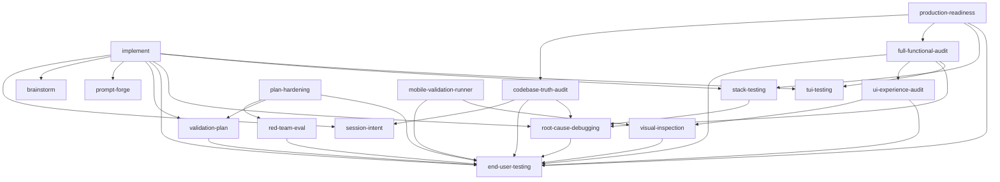

# Proofpunk Architecture — How the 19 Skills Execute as One System

This is the authoritative map of how the skills work **with one another**: who
owns each method, who calls whom, in what order, and why nothing is
duplicated. If you only read one doc, read this one.

## 1. The mental model

The 17 skills are **not** 19 independent procedures. They form a **directed
acyclic delegation graph**:

- **A method lives in exactly one skill** (its *owner*). Every other skill
  that needs that method **calls** the owner — it reads the owner's SKILL.md
  at the invocation point and applies the method verbatim. It never restates
  the method in its own body.
- **Calls are directional.** "A calls B" means: during A's execution, A
  defers to B's canonical method. Convenience pointers that would create a
  cycle are deliberately one-way (the stronger direction wins).
- **The graph is a DAG**, verified by `tools/verify-orchestration.py` on every
  change. Depth = how far a skill sits from the leaf owners:

```
depth 6  implement                     (the orchestrator — calls 9 skills)
depth 5  production-readiness
depth 4  codebase-truth-audit, full-functional-audit, plan-hardening, stack-testing
depth 3  mobile-validation-runner, red-team-eval, root-cause-debugging, ui-experience-audit
depth 1  validation-plan, visual-inspection
depth 0  brainstorm, end-user-testing, prompt-forge, session-intent, tui-testing   (leaf owners — call nothing)
```

## 2. Method ownership — the single source of truth

| Method | Owner | Consumers (call, never copy) |
|--------|-------|------------------------------|
| End-User Actor Mandate + fresh-evidence rules + verdict format | `end-user-testing` | every validation skill (11 deferrals) |
| Scout-first rule (GATE 2) + exact requirements (GATE 3) | `brainstorm` | `implement` |
| Proof-obligation XML format (`<proof_obligation id="PO-N">`) | `validation-plan` | `implement`, `plan-hardening` |
| Execution-loop contract (task → prove → next) | `implement` | (top of the write path) |
| Iron Rule of validation (fix the real system, no mocks) | `implement` (Stage 5) | `full-functional-audit` and all drivers |
| Screenshot examination protocol | `visual-inspection` | `mobile-validation-runner`, `ui-experience-audit`, `implement` (Stage 5) |
| Stuck protocol (attempt → root-cause ×3 → split → escalate) | `implement` | self-invoked per unproven task |
| TUI end-user proof (observe-then-act, matched waits, three facets) | `tui-testing` | `implement`, `full-functional-audit` |
| Root-cause method (no fix without reproduction) | `root-cause-debugging` | `stack-testing`, `codebase-truth-audit`, `full-functional-audit` |
| Four adversarial lenses | `red-team-eval` | `plan-hardening` (Stage 4 dispatch) |
| Prompt skeleton + rating rubric | `prompt-forge` | `implement` (Stage 3 FORGE) |
| Session mining (JSONL → intent matrix) | `session-intent` | `implement` (Stage 1 MINE), `codebase-truth-audit` (Stage 2) |

Measured deduplication: shared 12-word content blocks across all skill bodies
went from **911 → 121 shingles (−87%)** when this ownership was enforced; the
verbatim Actor Mandate went from **12 copies → 1 owner + one-line deferrals**.

## 3. The full call graph



## 4. Execution order, per entry point

This is the order the skills actually fire in when you run each slash
command. The verifier (`tools/verify-orchestration.py`) re-derives these
traces from the SKILL.md files and fails if the docs drift.

### `/proofpunk:implement "<goal>"` — the full pipeline

```
Stage 0  (implement)     Distill TRUE success criteria
Stage 1  session-intent  MINE past sessions for prior implementations
Stage 2  brainstorm      EXPLORE: scout-first + exact-requirements gates
Stage 3  prompt-forge    FORGE the build prompt (XML skeleton)
Stage 4  validation-plan DECOMPOSE: task graph, each task gets a PO-N
Stage 5  (implement)     EXECUTE loop, per task: production code, then INLINE
           └─ end-user driving        drive the real runtime as the end user
           └─ end-user-testing        prove it: Six Steps, sealed evidence
Stage 6  root-cause-debugging   stuck protocol on any unproven task
Stage 7  (implement)     REPORT from .planning/execution-ledger.json
+        stack-testing   regression rail: suites run AFTER proof, never AS proof
```


### `/proofpunk:truth-audit [path]` — evidence-backed audit

```
Stage 2  session-intent     reconstruct what the repo was ASKED to become
Stage 5  end-user-testing   runtime behavior claims get sealed evidence
on FAIL  root-cause-debugging  root cause of drift before remediation
```

### `/proofpunk:verify "<claim>"` — prove something works

```
(implement Stage 5 inline) detect platform, start the real runtime, drive it
end-user-testing       fresh evidence + verdict
visual-inspection      any screenshot evidence is examined, never trusted unread
```

### `/proofpunk:forge-prompt` / `/proofpunk:rate-prompt`

```
prompt-forge           author or RATE against the quantitative rubric
plan-hardening         (optional) harden the resulting prompt
```

## 5. Deferral rules (how "calling" works in practice)

1. **At the invocation point, read the callee's SKILL.md** — not the whole
   plugin. Progressive disclosure keeps this cheap.
2. **Apply the callee's method verbatim.** Do not paraphrase, summarize, or
   "adapt" it into the caller's body — that is how duplication regresses.
3. **One-line pointers are allowed; method content is not.** A caller may say
   *"owned by `end-user-testing` — apply its Actor Mandate verbatim"*; it may
   not restate the mandate.
4. **Cycles are forbidden.** If two skills feel mutually dependent, keep the
   stronger direction and demote the other to a Related-Skills note.
5. **The DAG is machine-checked.** `tools/verify-orchestration.py` parses the
   `## Skill calls` table in every SKILL.md, asserts closure/acyclicity,
   traces every entry point, and sweeps for re-emerging duplication.

## 6. Why this order is correct (the dependency argument)

Execution order is not convention — it is forced by data dependencies:

- **Stage 1 MINE before Stage 2 EXPLORE**: past-session intent tells the
  scouts *what to look for*; scouting first re-discovers what mining answers
  in seconds.
- **EXPLORE before FORGE**: a build prompt written before scouting encodes
  assumptions; written after, it encodes the codebase's real patterns.
- **DECOMPOSE before EXECUTE**: a task without a written proof obligation
  cannot be proven — the obligation defines the test before the work starts
  (test-first at the task level).
- **Proof inside the loop, not after it**: end-user testing at the end of a
  long build localizes nothing; proof per task pins failure to exactly one
  task's blast radius.
- **Regression rail last**: suites protect proven behavior; running them as
  validation inverts the dependency (a suite can pass while the feature is
  wrong — the end-user test cannot).
